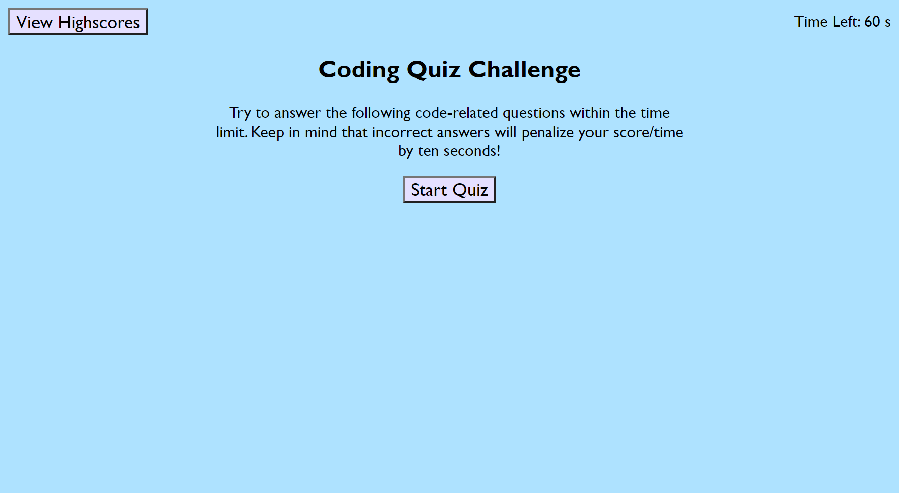
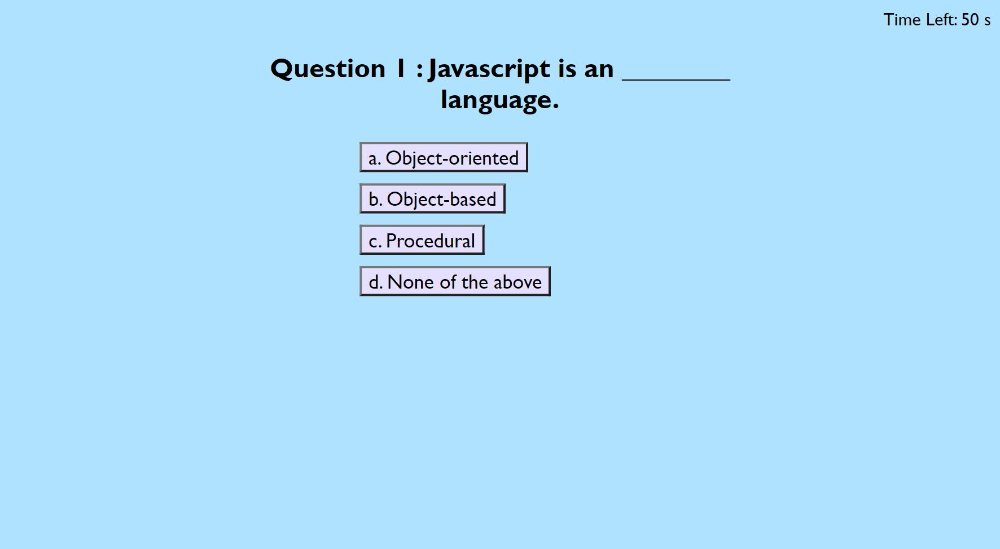

# js-fundamentals-quiz
Quiz on Javascript fundamentals

## Description

This is a web application that provides a quiz with questions related to Javascript.  The code of this application utilizes Javascript for much of the functionality including presentation of the questions and answer choices, validating the answers chosen, storing/retrieving saved high scores, a countdown timer, etc.  The general format of this quiz application could be used for other topics as well, just by changing the questions and answers in the javascript code.

## Usage

Application link:  xxxxxx

xxxxxx

## Credits

xxxxx

## Features

xxxxxxxxx
